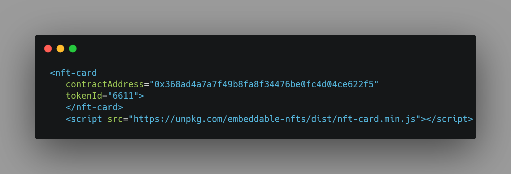
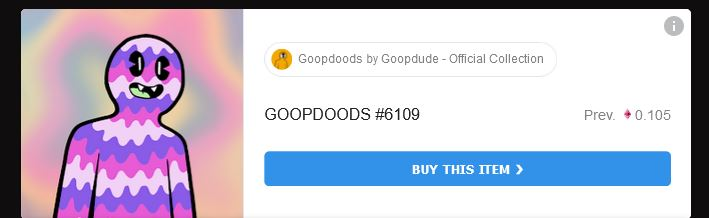
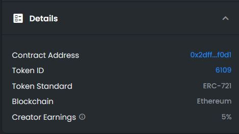

# nft-html
Show off your NFT's using only HTML!

## Sample Code

## Sample Output

## How to get your contract address & tokenID from your NFT.
- Locate your NFT on OpenSea or any other platform. We will use OpenSea as an example.
- Find the "Description" section and open the "Details" panel. It will look like this: 
- Click on the contract address to open it on etherscan and copy the contract address.
- Paste the contract address in contractAddress field.
- Go back to the "Details" Section and copy the tokenID and paste it into the tokenID field.

Enjoy :)
